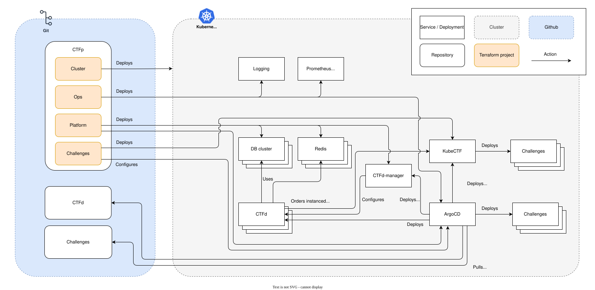
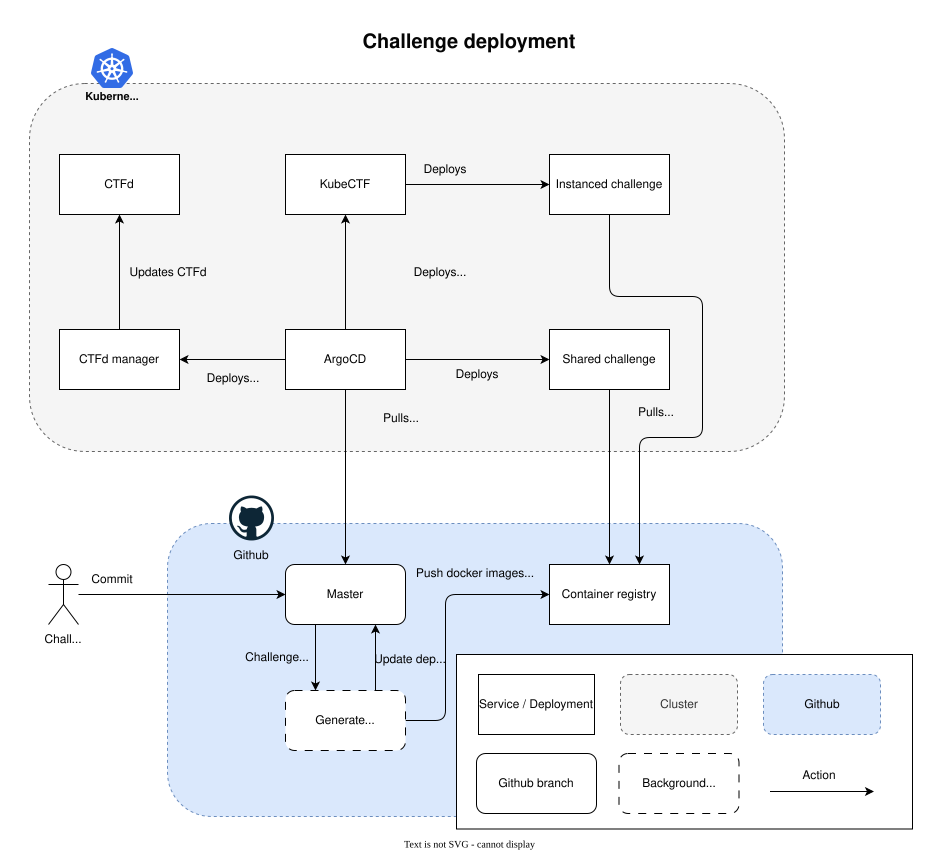
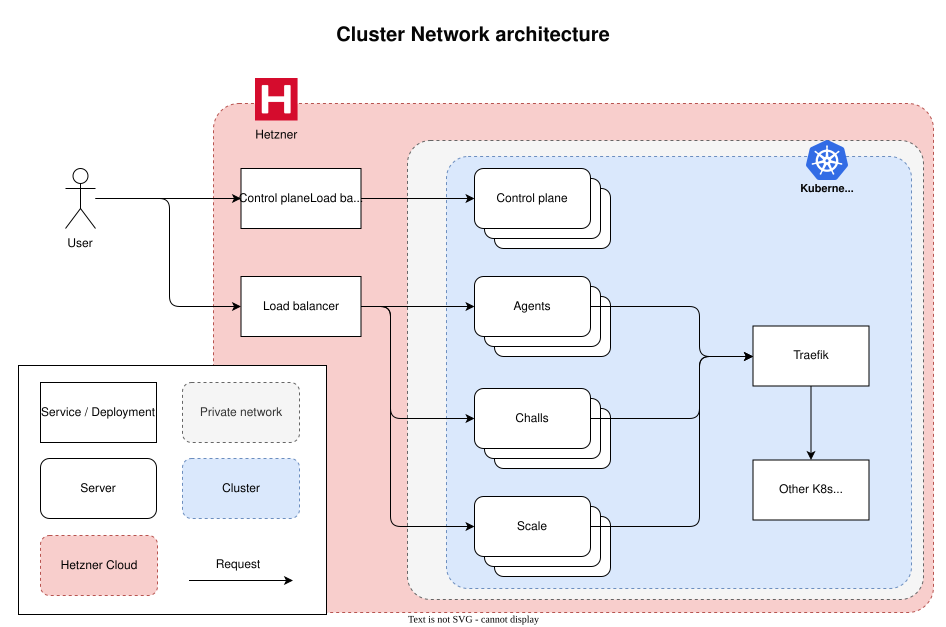
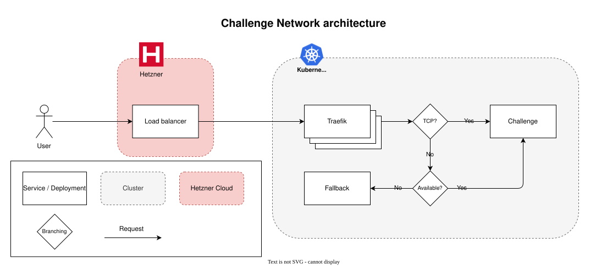

# CTFp - CTF Pilot's CTF Platform

> [!TIP]
> If you are looking for **how to build challenges for CTFp**, please check out the **[CTF Pilot's Challenges Template](https://github.com/ctfpilot/challenges-template)** and **[CTF Pilot's Challenge Toolkit](https://github.com/ctfpilot/challenge-toolkit)** repositories.

CTFp (CTF Pilot's CTF Platform) is a CTF platform designed to host large-scale Capture The Flag (CTF) competitions, with focus on scalability, resilience and ease of use.  
The platform uses Kubernetes as the underlying orchestration system, where both the management, scoreboard and challenge infrastructure are deployed as Kubernetes resources. It then leverages GitOps through [ArgoCD](https://argo-cd.readthedocs.io/en/stable/) for managing the platform's configuration and deployments, including the CTF challenges.

CTFp acts as the orchestration layer for deploying and managing the platform, while utilizing a variety of CTF Pilots components for providing the full functionality of the platform.

CTFp provides a CLI tool for managing the deployment of the platform, but it is possible to use the individual Terraform components directly if desired. To further work with the platform after initial deployment, you will primarily interact with the Kubernetes cluster using `kubectl`, ArgoCD and the other monitoring systems deployed.

> [!IMPORTANT]
> In order to run CTFp properly, you will need to have a working knowledge of **Cloud**, **Kubernetes**, **Terraform/OpenTofu**, **GitOps** and **CTFd**.  
> The platform is designed to work with CTF Pilot's Challenges ecosystem, to ensure secure hosting of CTF challenges.
>
> This platform is not intended for beginners, and it is assumed that you have prior experience with these technologies and systems.  
> Incorrect handling of Kubernetes resources can lead to data loss, downtime and security vulnerabilities.  
> Incorrectly configured challenges may lead to security vulnerabilities or platform instability.

This platform deploys real world infrastructure, and will incur costs when deployed.

## Table of Contents

- [CTFp - CTF Pilot's CTF Platform](#ctfp---ctf-pilots-ctf-platform)
  - [Table of Contents](#table-of-contents)
  - [Features](#features)
  - [Quick start](#quick-start)
  - [How to run](#how-to-run)
    - [Pre-requisites](#pre-requisites)
    - [Environments](#environments)
    - [Configuring the platform](#configuring-the-platform)
    - [CLI Tool](#cli-tool)
      - [Commands](#commands)
        - [`init` - Initialize Platform Configuration](#init---initialize-platform-configuration)
        - [`generate-keys` - Generate SSH Keys](#generate-keys---generate-ssh-keys)
        - [`insert-keys` - Insert SSH Keys into Configuration](#insert-keys---insert-ssh-keys-into-configuration)
        - [`generate-images` - Generate Custom Server Images](#generate-images---generate-custom-server-images)
        - [`generate-backend` - Generate Terraform Backend Configuration](#generate-backend---generate-terraform-backend-configuration)
        - [`deploy` - Deploy Platform Components](#deploy---deploy-platform-components)
        - [`destroy` - Destroy Platform Components](#destroy---destroy-platform-components)
    - [Workflow Overview](#workflow-overview)
    - [Guides](#guides)
      - [Updating sizes of nodes in a running platform](#updating-sizes-of-nodes-in-a-running-platform)
      - [Deploying a new challenge](#deploying-a-new-challenge)
      - [Updating a challenge](#updating-a-challenge)
      - [Deplyoing a page](#deplyoing-a-page)
      - [The CLI tool does not seem to support my setup](#the-cli-tool-does-not-seem-to-support-my-setup)
  - [Architecture](#architecture)
    - [Directory structure](#directory-structure)
    - [Overview](#overview)
      - [Cluster](#cluster)
        - [Cluster requirements](#cluster-requirements)
    - [Challenge deployment](#challenge-deployment)
    - [Network](#network)
      - [Cluster networking](#cluster-networking)
      - [Challenge networking](#challenge-networking)
  - [Getting help](#getting-help)
  - [Contributing](#contributing)
  - [Background](#background)
  - [License](#license)
  - [Code of Conduct](#code-of-conduct)

## Features

CTFp offers a wide range of features to facilitate the deployment and management of CTF competitions. Below is an overview of the key features:

- **Infrastructure & Deployment**
  - **Multi-environment support** with isolated configurations for Test, Dev, and Production
  - **Component-based architecture** with four deployable components: Cluster, Ops, Platform, and Challenges
  - **Infrastructure as Code** using Terraform/OpenTofu with automated state management and S3 backend
  - **Multi-region Kubernetes clusters** on Hetzner Cloud with configurable node types and auto-scaling
  - **Custom server images** generation using Packer
  - **Cloudflare DNS integration** for management, platform, and CTF zones
- **Operations & Monitoring**
  - **GitOps workflow** powered by ArgoCD for automated deployments
  - **Comprehensive monitoring** with Prometheus, Grafana, and metrics exporters
  - **Log aggregation** via Filebeat to Elasticsearch
  - **Traefik ingress controller** with SSL certificate management (cert-manager)
  - **Discord webhook notifications** for platform events
  - **Automated descheduling** for optimal resource distribution
- **Scoreboard**
  - **Customizable CTFd scoreboard deployment** allowing for bring-your-own CTFd configuration
  - **Auto deployment of CTFd configuration** providing a ready-to-use CTFd instance
  - **Flexible CTF settings** supporting a large portion of CTFd's configuration options
  - **S3 storage configuration** for challenge files and user uploads in CTFd
  - **Clustered database setup** with MariaDB operator and automated backups to S3
  - **Redis caching** with Redis operator for ease of use
  - **Automatic deployment of CTFd pages** from GitHub
- **Challenge Management**
  - **Full support for CTF Pilot's Challenges ecosystem**, including KubeCTF integration
  - **Support for three challenge deployment modes**: Isolated, Shared, and Instanced
  - **Git-based deployment** with branch-specific configurations
  - **IP whitelisting** for challenge access control
  - **Custom fallback pages** for errors and instancing states
- **CLI Tool**
  - **Simple command-line interface** for managing the deployment and lifecycle of the platform
  - **Modular commands** for initializing, deploying, destroying, and managing components
  - **Environment management** for handling multiple deployment environments (Test, Dev, Prod)
  - **State management** with automated backend configuration, with states stored in S3
  - **Plan generation and review** before applying changes
  - **Sub 20 minute deployment time** for the entire platform (excluding image generation)
  - **Fully configured through configuration files** for easy setup and management

## Quick start

> [!TIP]
> **This is a quick start guide for getting the platform up and running, and acts as a quick reference guide.**  
> If it is your first time working with CTFp, we recommend going through the full documentation for a more in-depth understanding of the platform and its components.

To use the CTFp CLI tool, you first need to clone the repository:

```bash
git clone https://github.com/ctfpilot/ctfp
cd ctfp
```

First you need to initialize the platform configuration for your desired environment (test, dev, prod):

```bash
./ctfp.py init
```

> [!NOTE]
> You can add `--test`, `--dev` or `--prod` to specify the environment you want to initialize.  
> The default environment is `test` (`--test`).
>
> Used in all commands, except the `generate-images` command, as it asks for the Hetzner Cloud project to use when generating images.

Next, you need to fill out the configuration located in the `automated.<env>.tfvars` file.

In order to deploy, ensure you have SSH keys created, and inserted into your configuration:

```bash
./ctfp.py generate-keys --insert
```

To create the server images used for the Kubernetes cluster nodes, run:

```bash
./ctfp.py generate-images
```

To use the Terraform modules, you need to generate the backend configuration for each component.

```bash
./ctfp.py generate-backend cluster <bucket> <region> <endpoint>
./ctfp.py generate-backend ops <bucket> <region> <endpoint>
./ctfp.py generate-backend platform <bucket> <region> <endpoint>
./ctfp.py generate-backend challenges <bucket> <region> <endpoint>
```

*Replace `<bucket>`, `<region>` and `<endpoint>` with your S3 bucket details.*

Finally, you can deploy the entire platform with:

```bash
./ctfp.py deploy all
```

To destroy the entire platform, run:

```bash
./ctfp.py destroy all
```

`all` can be replaced with any of the individual components: `cluster`, `ops`, `platform`, `challenges`.

To interact with the cluster, run the following command to configure your `kubectl` context:

```bash
source kubectl.sh [test|dev|prod]
```

*`source` is required to set the environment variables in your current shell session.*

## How to run

### Pre-requisites

In order to even deploy the platform, the following software needs to be installed on your local machine:

- [OpenTofu](https://opentofu.org) (Alternative version of [Terraform](https://www.terraform.io/downloads.html))
- [Packer](https://developer.hashicorp.com/packer/tutorials/docker-get-started/get-started-install-cli#installing-packer) - For initial generation of server images
- [Kubectl](https://kubernetes.io/docs/tasks/tools/install-kubectl/) - For interacting with the Kubernetes cluster
- [hcloud cli tool](https://github.com/hetznercloud/cli) - For interacting with the Hetzner Cloud API (Otherwise use the Hetzner web interface)
- SSH client - For connecting to the servers
- Python 3 - For running the CTFp CLI tool
- Python package [`python-hcl2`](https://github.com/amplify-education/python-hcl2) - Required by the CTFp CLI tool for parsing Terraform configuration files

And the following is required in order to deploy the platform:

- [Hetzner Cloud](https://www.hetzner.com/cloud) account with one or more Hetzner Cloud projects
- [Hetzner Cloud API Token](https://console.hetzner.cloud/projects) - For authenticating with the Hetzner Cloud API
- [Hetzner S3 buckets](https://console.hetzner.cloud/projects) - For storing the Terraform state files, backups and challenge data. We recommend using 3 separate buckets with separate access keys for security reasons
- [Cloudflare](https://www.cloudflare.com/) account
- [Cloudflare API Token](https://dash.cloudflare.com/profile/api-tokens) - For authenticating with the Cloudflare API
- [3 Cloudflare controlled domains](https://dash.cloudflare.com/) - For allowing the system to allocate a domain for the Kubernetes cluster. Used to allocate management, platform and challenge domains.
- SMTP mail server - To allow CTFd to send emails to users (Password resets, notifications, etc.). The system is set up to allow outbound connections to [Brevo](https://brevo.com) SMTP on port 587.
- [Discord](https://discord.com) channels to receive notifications. One for monitoring alerts and one for first-blood notifications.
- GitHub repository following [CTF Pilot's Challenges template](https://github.com/ctfpilot/challenges-template) for CTF challenges and CTFd pages - A Git repository containing the CTF challenges to be deployed. This should be your own private repository using the CTF Pilot Challenges Template as a base. This may also contain the pages to be used in CTFd.
- GitHub repository containing the CTFd configuration - We recommend forking [CTF Pilot's CTFd configuration repository](https://github.com/ctfpilot/ctfd).
- Access tokens to access the GitHub repositories and container registry - Fine-grained personal access token and Personal Access Tokens (PAT) with read access to the repositories containing the CTF challenges and CTFd configuration and GitHub container registry. We recommend setting up a bot account for this purpose.
- [Elasticsearch endpoint](https://www.elastic.co/) - Elasticsearch instance with an endpoint and user credentials for log aggregation. Used to connect Filebeat to Elasticsearch.

### Environments

CTFp supports three different environments for deployment:

- **Test**: Intended for testing and experimentation. This environment is suitable for trying out new features, configurations, and updates without affecting the production environment. It is recommended to use smaller server sizes and fewer nodes to minimize costs.
- **Dev**: Intended for development and staging purposes. This environment is suitable for testing new challenges, configurations, and updates before deploying them to production. It should closely resemble the production environment in terms of server sizes and configurations, but can still be scaled down to save costs.
- **Prod**: Intended for hosting live CTF competitions. This environment should be configured for high availability, performance, and security. It is recommended to use larger server sizes, more nodes, and robust configurations to ensure a smooth experience for participants.

The environments are configured through separate `automated.<env>.tfvars` files, allowing for isolated configurations and deployments.

In the CLI tool, you can specify the environment using the `--test`, `--dev`, or `--prod` flags in the commands. If no flag is provided, the default environment is `test`.

### Configuring the platform

> [!TIP]
> To understand the full configuration options and their implications, please refer to the documentation in the `automated.<env>.tfvars` or [`template.automated.tfvars`](./template.automated.tfvars) file.

To configure the platform, you need to configure the `automated.<env>.tfvars` file located in the root of the repository.

It contains a number of configuration options for the platform.  
Each configuration option is within the file, explaining and listed with its possible values.

An automated check, checks if all values are filled out correctly when running the CLI tool.  
Therefore, be sure to fill out all required values before attempting to deploy the platform.  
Non-required values are per default commented out, and can be left as is if the default value is acceptable.

The configuration file is the single source of truth for the platform's configuration, and is used by the CLI tool to deploy and manage the platform.  
If configuration in the configuration file is changed, the changes will be applied to the platform during the next deployment.  
If the platform is manually changed outside of the CLI tool, the changes will be reverted during the next deployment.

> [!IMPORTANT]
> The `template.automated.tfvars` file is git tracked, and **MUST NOT** be changed in the repository to include sensitive information.  
> Instead, copy the file to `automated.<env>.tfvars` and fill out the values there.  
> The `automated.<env>.tfvars` files are git ignored, and will not be tracked by git.
>
> The file can be initialized using the `./ctfp.py init` command.

Each component is not fully configurable, and may in certain situation required advanced configuration. These configurations are not included in the main configuration file.
These options are either intended to be static, or require manual configuration through the individual Terraform components.  
Changing these options may lead to instability or data loss, and should be done with caution.

### CLI Tool

The CTFp CLI tool is a Python script that can be executed directly from the command line, and manages the deployment and lifecycle of the CTFp platform.

**Prerequisites:**

1. Install required Python dependencies:

   ```bash
   pip install -r requirements.txt
   ```

   This installs `python-hcl2`, which is required for parsing Terraform configuration files.

2. Ensure the script has executable permissions:

   ```bash
   chmod +x ctfp.py
   ```

**Running the CLI tool:**

You can now run commands directly:

```bash
./ctfp.py <command> [options]
```

Alternatively, you can always run it explicitly with Python:

```bash
python3 ctfp.py <command> [options]
```

Both methods are functionally equivalent. The direct execution method (first example) is more convenient for regular use.

#### Commands

> [!TIP]
> You can run any command with the `--help` flag to get more information about the command and its options.  
> For example: `./ctfp.py deploy --help`
>
> Available commands:
>
> - `init` - Initialize Platform Configuration
> - `generate-keys` - Generate SSH Keys
> - `insert-keys` - Insert SSH Keys into Configuration
> - `generate-images` - Generate Custom Server Images
> - `generate-backend` - Generate Terraform Backend Configuration
> - `deploy` - Deploy Platform Components
> - `destroy` - Destroy Platform Components

Below is a detailed overview of each available command:

##### `init` - Initialize Platform Configuration

Initializes the platform configuration for a specified environment by creating an `automated.<env>.tfvars` file based on the template.

**Syntax:**

```bash
./ctfp.py init [--force] [--test|--dev|--prod]
```

**Options:**

- `--force`: Force overwrite the configuration file if it already exists (by default, the tool prompts before overwriting)
- `--test`: Initialize TEST environment (default)
- `--dev`: Initialize DEV environment
- `--prod`: Initialize PROD environment

**Example:**

```bash
./ctfp.py init --test
./ctfp.py init --prod --force
```

**Output:** Creates `automated.test.tfvars`, `automated.dev.tfvars`, or `automated.prod.tfvars` in the repository root.

##### `generate-keys` - Generate SSH Keys

Generates SSH keys (ed25519) required for accessing the cluster nodes. Optionally inserts the base64-encoded keys directly into the configuration file.

**Syntax:**

```bash
./ctfp.py generate-keys [--insert] [--test|--dev|--prod]
```

**Options:**

- `--insert`: Automatically insert the generated keys into the `automated.<env>.tfvars` file
- `--test`: Generate keys for TEST environment (default)
- `--dev`: Generate keys for DEV environment
- `--prod`: Generate keys for PROD environment

**Example:**

```bash
./ctfp.py generate-keys --insert --test
./ctfp.py generate-keys --dev
```

**Output:** Creates `keys/k8s-<env>.pub` (public key) and `keys/k8s-<env>` (private key) in the `keys/` directory.

##### `insert-keys` - Insert SSH Keys into Configuration

Manually inserts previously generated SSH keys into the configuration file. Useful if keys were generated separately or if you need to update existing keys.

**Syntax:**

```bash
./ctfp.py insert-keys [--test|--dev|--prod]
```

**Options:**

- `--test`: Insert keys for TEST environment (default)
- `--dev`: Insert keys for DEV environment
- `--prod`: Insert keys for PROD environment

**Example:**

```bash
./ctfp.py insert-keys --test
./ctfp.py insert-keys --prod
```

**Prerequisite:** Keys must already exist in the `keys/` directory.

##### `generate-images` - Generate Custom Server Images

Generates custom Packer images for Kubernetes cluster nodes. These images are used when provisioning the cluster infrastructure on Hetzner Cloud.

**Syntax:**

```bash
./ctfp.py generate-images
```

> [!NOTE]
> The `generate-images` command does not use environment flags. It requires you to select the Hetzner Cloud project interactively during execution.

**Output:** Packer creates and uploads custom images to your Hetzner Cloud project.

**Time:** This is typically the longest-running operation, taking 5-15 minutes.

##### `generate-backend` - Generate Terraform Backend Configuration

Generates the Terraform backend configuration file (`backend.tf`) for the specified environment. This file configures the S3 backend for storing Terraform state files.

**Syntax:**

```bash
./ctfp.py generate-backend <component> <bucket> <region> <endpoint>
```

**Arguments:**

- `<component>`: Component for which to generate the backend configuration: `cluster`, `ops`, `platform`, or `challenges`
- `<bucket>`: Name of the S3 bucket to use for storing the Terraform state
- `<region>`: Region where the S3 bucket is located
- `<endpoint>`: Endpoint URL for the S3-compatible storage. For example `nbg1.your-objectstorage.com` for Hetzner Cloud Object Storage in `nbg1` region.

**Example:**

```bash
./ctfp.py generate-backend cluster ctfp-cluster-state nbg1 nbg1.your-objectstorage.com
./ctfp.py generate-backend platform ctfp-platform-state fsn1 fsn1.your-objectstorage.com
```

**Output:** Creates a HCL configuration for the specified component's Terraform backend in the `backend/generated/` directory.

See more about this command in the [backend directory](./backend).

##### `deploy` - Deploy Platform Components

Deploys one or more components of the platform to the specified environment. Can deploy individual components or the entire platform at once.

**Syntax:**

```bash
./ctfp.py deploy <component> [--auto-apply] [--test|--dev|--prod]
```

**Arguments:**

- `<component>`: Component to deploy: `cluster`, `ops`, `platform`, `challenges`, or `all`
  - `cluster`: Provisions Kubernetes infrastructure on Hetzner Cloud
  - `ops`: Deploys operational tools (ArgoCD, monitoring, logging, ingress)
  - `platform`: Deploys CTFd scoreboard and associated services
  - `challenges`: Deploys CTF challenges infrastructure
  - `all`: Deploys all components in sequence

**Options:**

- `--auto-apply`: Automatically apply Terraform changes without interactive prompts (use with extreme caution)
- `--test`: Deploy to TEST environment (default)
- `--dev`: Deploy to DEV environment
- `--prod`: Deploy to PROD environment

**Example:**

```bash
./ctfp.py deploy all --test
./ctfp.py deploy cluster --prod
./ctfp.py deploy platform --dev --auto-apply
```

**Deployment Order:** When deploying `all`, components are deployed in this order: `cluster` → `ops` → `platform` → `challenges`. Each component must be successfully deployed before the next begins.

**Output:** Creates Terraform state files in the `terraform/` directory and outputs deployment status and timing information.

##### `destroy` - Destroy Platform Components

> [!WARNING]
> Destroying the platform will **delete all data** associated with the environment, including databases, user data, and challenge instances. This action cannot be undone. Always ensure you have backups before destroying production environments.

Destroys one or more components of the platform. This is the reverse of `deploy` and tears down infrastructure, databases, and services.

**Syntax:**

```bash
./ctfp.py destroy <component> [--auto-apply] [--test|--dev|--prod]
```

**Arguments:**

- `<component>`: Component to destroy: `cluster`, `ops`, `platform`, `challenges`, or `all`

**Options:**

- `--auto-apply`: Automatically confirm destruction without interactive prompts (use with extreme caution)
- `--test`: Destroy TEST environment (default)
- `--dev`: Destroy DEV environment
- `--prod`: Destroy PROD environment

**Example:**

```bash
./ctfp.py destroy all --prod
./ctfp.py destroy challenges --test --auto-apply
```

**Destruction Order:** When destroying `all`, components are destroyed in reverse order: `challenges` → `platform` → `ops` → `cluster`. This ensures dependencies are properly cleaned up.

### Workflow Overview

The workflow for deploying and managing CTFp can be summarized in the following key phases:

1. **Setup Phase**:
   - Clone the repository and generate backend configurations.

2. **Preparation Phase**:
   - Generate custom server images (one-time setup per Hetzner project).
   - Generate SSH keys.
   - Create needed pre-requisites.
   - Configure the platform using the `automated.<env>.tfvars` file.

3. **Deployment Phase**:
   - Deploy components in sequence: `Cluster → Ops → Platform → Challenges`.
   - Use `deploy all` for automated deployment or deploy components individually.

4. **Live Operations**:
   - Monitor the platform using tools like ArgoCD, Grafana, and Prometheus.
   - Manage challenges, and apply updates as needed.

5. **Teardown Phase**:
   - Destroy components in reverse order: `Challenges → Platform → Ops → Cluster`.
   - Use `destroy all` for automated teardown or destroy components individually.

### Guides

#### Updating sizes of nodes in a running platform

> [!TIP]
> When upgrading existing clusters, it is recommended to drain node pools before changing their sizes, to avoid disruption of running workloads.  
> Along with updating one node pool at a time, to minimize the impact on the cluster.

When updating the sizes of nodes in an existing cluster, it is important to follow a specific procedure to ensure a smooth transition and avoid downtime or data loss.  
Below are the steps to update the sizes of nodes in an existing cluster:

1. **Drain the Node Pool**: Before making any changes, drain the node pool that you intend to update. This will safely evict all workloads from the nodes in the pool, allowing them to be rescheduled on other nodes in the cluster.

    ```bash
    # List nodes
    kubectl get nodes

    # Drain each node in the node pool
    kubectl drain <node-name> --ignore-daemonsets --delete-local-data
    ```

   *You will need to repeat this for each node in the node pool. You can use tools such as [`draino`](https://github.com/planetlabs/draino) to automate this process.*

2. **Update the Configuration**: Modify the `automated.<env>.tfvars` file to reflect the new sizes for the nodes in the node pool. Ensure that you only change the sizes for the specific node pool you are updating.
3. **Deploy the Changes**: Use the CTFp CLI tool to deploy the changes to the cluster. This will apply the updated configuration and resize the nodes in the specified node pool.

    ```bash
    ./ctfp.py deploy cluster --<env>
    ```

   *Replace `<env>` with the appropriate environment flag (`--test`, `--dev`, or `--prod`).*
4. **Monitor the Deployment**: Keep an eye on the deployment process to ensure that the nodes are resized correctly and that there are no issues. You can use `kubectl get nodes` to check the status of the nodes in the cluster.
5. **Uncordon the Node Pool**: Once the nodes have been resized and are ready, uncordon the node pool to allow workloads to be scheduled on the nodes again.

    ```bash
    kubectl uncordon <node-name>
    ```

   *Repeat this for each node in the node pool.*
6. **Verify the Changes**: Finally, verify that the workloads are running correctly on the resized nodes and that there are no issues in the cluster.
7. **Repeat for Other Node Pools**: If you have multiple node pools to update, repeat the above steps for each node pool, one at a time.

> [!WARNING]
> Changing node sizes can lead to temporary disruption of workloads.  
> Always ensure that you have backups of critical data before making changes to the cluster configuration.

Changes to the `scale_type` will only affect new nodes being created, and will not resize existing nodes, as the deployment of these nodes are done as resources are needed.

You may need to manually intervene to resize existing nodes if required, or delete them, forcing the system to create new nodes with the updated sizes. However, this may lead to downtime for workloads running on the nodes being deleted.

> [!NOTE]
> Downscaling nodes may not be possible, depending on the initial size of the nodes and the new size.

Hetzner does not support downsizing nodes, if they were initially created with a larger size.  
In such cases, the nodes will need to be deleted, forcing the system to create new nodes with the desired size.

#### Deploying a new challenge

To deploy a new challenge, you will need to add the challenge to the configuration file, and then deploy the changes to the platform.

Challenges are split into three types:

- `static` - Static challenge, often with a handout (files, puzzles, etc.).
- `shared` - Challenge with a single instance for all teams to connect to.
- `instanced` - Challenge with individual instances for each team.

The challenge should be formatted using the [CTF Pilot's Challenges Template](https://github.com/ctfpilot/challenges-template), and build using the [CTF Pilot's Challenge Toolkit](https://github.com/ctfpilot/challenge-toolkit) and [CTF Pilot's Challenge Schema](https://github.com/ctfpilot/challenge-schema).

In the configuration file, you will need to add the challenge under the `Challenges configuration` section.

For static files, add the challenge under the `challenges_static` list:

```hcl
challenges_static = {
  <category> = [
    "<challenge-slug>"
  ]
}
```

For shared challenges, add the challenge under the `challenges_shared` list:

```hcl
challenges_shared = {
  <category> = [
    "<challenge-slug>"
  ]
}
```

For instanced challenges, add the challenge under the `challenges_instanced` list:

```hcl
challenges_instanced = {
  <category> = [
    "<challenge-slug>"
  ]
}
```

An example of this, using [CTF Pilot's Challenges example repository](https://github.com/ctfpilot/challenges-example), would look like this:

```hcl
challenges_static = {
  forensics = ["oh-look-a-flag"],
}
challenges_shared = {
  web = ["the-shared-site"],
}
challenges_instanced = {
  web  = ["where-robots-cannot-search"],
  misc = ["a-true-connection"],
}
```

In order to deploy the new challenge, you need to deploy the `challenges` component using the CLI tool:

```bash
./ctfp.py deploy challenges --<env>
```

Removing a challenge required you to remove it from the configuration file, and then deploy the `challenges` component again.

Challenge changes are automatically and continuously deployed through ArgoCD, so no manual intervention is required after the initial deployment.

#### Updating a challenge

Challenge updates are handled through the Git repository containing the challenges.

If a challenges slug has been changed, you need to remove the old slug from the configuration file, and add the new slug.
For this, follow the [Deploying a new challenge](#deploying-a-new-challenge) guide.

#### Deplyoing a page

To deploy a new page to CTFd, you will need to add the page to a Git repository that should be formatted using the [CTF Pilot's Challenges Template](https://github.com/ctfpilot/challenges-template), and build using the [CTF Pilot's Challenge Toolkit](https://github.com/ctfpilot/challenge-toolkit) and [CTF Pilot's Page Schema](https://github.com/ctfpilot/page-schema).

In the configuration file, you will need to add the page under the `Pages configuration` section.

For pages, add the page under the `pages` list:

```hcl
pages = [
  "<page-slug>"
]
```

An example of this, using the [CTF Pilot's Challenges example repository](https://github.com/ctfpilot/challenges-example), would look like this:

```hcl
pages = ["index"]
```

In order to deploy the new page, you need to deploy the `platform` component using the CLI tool:

```bash
./ctfp.py deploy platform --<env>
```

To remove a page, you need to remove it from the configuration file, and then deploy the `platform` component again.

Page changes are automatically and continuously deployed through ArgoCD, so no manual intervention is required after the initial deployment.

#### The CLI tool does not seem to support my setup

The CLI tool is designed to cover a wide range of deployment scenarios, but it may be that your specific setup require some custom setup in each Terraform component.

Each component is located in its own directory, and can be deployed manually using OpenTofu/terraform commands.

However, be aware that the CLI tool also manages the Terraform backend configuration, and you will need to set this up manually if you choose to deploy the components manually.

Documentation is located within each component directory, explaining the configuration options and how to deploy the component manually.  
A template tfvars file is also located in each component directory in `tfvars/template.tfvars`, explaining the configuration options available for that component.

## Architecture

CTFp is composed of four main components, each responsible for different aspects of the platform's functionality:

1. **Cluster**: Responsible for provisioning and managing the underlying Kubernetes cluster infrastructure on Hetzner Cloud.  
   This includes setting up the necessary servers, networking, and storage resources required for the cluster to operate.  
   This can be found in the [`cluster`](./cluster) directory, and as the `cluster` component in the CLI tool.
2. **Ops** (Operations): Focuses on deploying and managing the operational tools and monitoring systems for the platform.  
   This includes setting up ArgoCD, monitoring, logging, ingress controllers, and other essential services that ensure the smooth operation of the platform.  
   This can be found in the [`ops`](./ops) directory, and as the `ops` component in the CLI tool.
3. **Platform**: Handles the deployment and configuration of the CTFd scoreboard and its associated services.  
   This includes setting up the database, caching, and storage solutions required for the scoreboard to function effectively.  
   This can be found in the [`platform`](./platform) directory, and as the `platform` component in the CLI tool.
4. **Challenges**: Manages the deployment and configuration of the CTF challenges.  
   This includes setting up the necessary resources and configurations to host and manage the challenges securely and efficiently.  
   This can be found in the [`challenges`](./challenges) directory, and as the `challenges` component in the CLI tool.

Each component is designed to be modular and can be deployed independently or together, allowing for flexibility in managing the platform's infrastructure and services.

### Directory structure

The CTFp repository is structured as follows:

```txt
ctfp/
├── backend/                   # Terraform backend configurations
├── keys/                      # Generated SSH keys
├── terraform/                 # Terraform plans
├── tf-modules/                # Reusable Terraform modules
├── cluster/                   # Cluster component Terraform configurations
├── ops/                       # Ops component Terraform configurations
├── platform/                  # Platform component Terraform configurations
├── challenges/                # Challenges component Terraform configurations
├── ctfp.py                    # CTFp CLI tool
├── kubectl.sh                 # Script for configuring kubectl context
├── README.md                  # This README file
├── requirements.txt           # Python dependencies for the CLI tool
├── template.automated.tfvars  # Template for CTFp CLI configuration
└── ...                        # Other files and directories, such as license, contributing guidelines, etc.
```

### Overview



The above figure, details how the different components come together to form the complete CTFp platform.  
It highlights the central elements: [CTFd](https://github.com/ctfpilot/ctfd), DB Cluster, Redis, [CTFd-manager](https://github.com/ctfpilot/ctfd-manager), [KubeCTF](https://github.com/ctfpilot/kube-ctf), monitoring and deployment flow.

*The figure serves as an overview of the platform's architecture, and does therefore not include all components and services involved in the platform.*

#### Cluster

The Cluster component is responsible for provisioning and managing the Kubernetes cluster infrastructure on Hetzner Cloud.

It deploys a [kube-hetzner](https://github.com/kube-hetzner/terraform-hcloud-kube-hetzner) cluster within the Hetzner Cloud environment, setting up the necessary servers, networking, and storage resources required for the cluster to operate.

Specifically, it handles:

- **Cluster provisioning**: Creating and configuring the Kubernetes cluster using Hetzner Cloud resources.
- **Node management**: Setting up and managing the worker nodes that will run the workloads.  
  This including configuring node pools, scaling, and updating nodes as needed, along with setting up the node-autoscaler for automatic scaling based on demand.
- **Networking**: Configuring the network settings to ensure proper communication between cluster components.  
  This includes setting up a private network, configuring VPN connectivity between the nodes and setting up Flannel CNI for pod networking.  
  Opens up required firewall rules to allow communication between nodes, and outbound connections to required services.
- **Storage**: Setting up storage controller (CSI) to use Hetzner Block storage volumes.
- **Traefik proxy**: Deploying Traefik as the ingress controller for managing incoming traffic to the cluster.

If an alternative cluster setup is desired, the Cluster component can be replaced with a different Kubernetes cluster, as long as it meets the requirements for running the platform.

##### Cluster requirements

The Kubernetes cluster used for CTFp must meet the following requirements:

- Kubernetes version 1.33 or higher
- Traefik ingress controller, with correctly configured load balancer
- Persistent storage support (CSI). You may use whatever storage solution you prefer, as long as it supports dynamic provisioning of Persistent Volumes, and is set as the default storage class.
- Provides a kubeconfig file for the cluster, to allow the CLI tool to interact with the cluster. This config should have full admin access to the cluster.
- Has at least a single node with the taint `cluster.ctfpilot.com/node=scaler:PreferNoSchedule` for running challenge instances.  
  *May be skipped, if no instanced challenges are to be deployed, or you change the taints in the challenge deployment configuration.*
- Enough resources to run the platform components.  
  *This depends on the CTFd setup, challenges and CTF size.*
- Has correct firewall rules to allow outbound connections to required services, such as logging aggregation, SMTP servers, Discord, Cloudflare API, GitHub, and reverse connections from challenges (if they need internet access).
- Flannel CNI installed for networking.
- Cert-manager is not installed, as it is managed by the Ops component.

### Challenge deployment



### Network

#### Cluster networking



#### Challenge networking



## Getting help

The project is built and maintained by the CTF Pilot team, which is a community-driven effort.

If you need help or have questions regarding CTFp, you can reach out through the following channels:

- **GitHub Issues**: You can open an issue in the [CTFp GitHub repository](https://github.com/ctfpilot/ctfp/issues) for bug reports, feature requests, or general questions.
- **Discord**: Join the [CTF Pilot Discord server](https://discord.ctfpilot.com) to engage with the community, ask questions, and get support from other users and contributors.

## Contributing

We welcome contributions of all kinds, from **code** and **documentation** to **bug reports** and **feedback**!

Please check the [Contribution Guidelines (`CONTRIBUTING.md`)](/CONTRIBUTING.md) for detailed guidelines on how to contribute.

CTFp is a dual-licensed project. To maintain the ability to distribute contributions across all our licensing models, **all code contributions require signing a Contributor License Agreement (CLA)**.

You can review **[the CLA here](https://github.com/ctfpilot/cla)**. CLA signing happens automatically when you create your first pull request.  
To administrate the CLA signing process, we are using **[CLA assistant lite](https://github.com/marketplace/actions/cla-assistant-lite)**.

*A copy of the CLA document is also included in this repository as [`CLA.md`](CLA.md).*  
*Signatures are stored in the [`cla` repository](https://github.com/ctfpilot/cla).*

## Background

CTF Pilot started as a CTF Platform project, originating in **[Brunnerne](https://github.com/brunnerne)**.

The goal of the project, is to provide a scalable, resilient and easy to use CTF platform for hosting large scale Capture The Flag competitions, starting with BrunnerCTF 2025.

The project is still in active development, and we welcome contributions from the community to help improve and expand the platform's capabilities.

## License

CTFp is licensed under a dual license, the **PolyForm Noncommercial License 1.0.0** for non-commercial use, and a **Commercial License** for commercial use.  
You can find the full license for non-commercial use in the **[LICENSE.md](LICENSE.md)** file.  
For commercial licensing, please contact **[The0Mikkel](https://github.com/The0Mikkel)**.

Without commercial licensing, the platform **MUST NOT** be used for commercial purposes, including but not limited to:

- Hosting CTF competitions for profit
- Hosting a CTF as a commercial organization, even if the CTF itself is free or only provided to internal users
- Offering CTF hosting as a paid service
- Using the platform in any commercial product or service

We encourage all modifications and contributions to be shared back with the community, for example through pull requests to this repository.  
We also encourage all derivative works to be publicly available under **PolyForm Noncommercial License 1.0.0**.  
At all times must the license terms be followed.

For information regarding how to contribute, see the [contributing](#contributing) section above.

CTF Pilot is owned and maintained by **[The0Mikkel](https://github.com/The0mikkel)**.  
Required Notice: Copyright Mikkel Albrechtsen (<https://themikkel.dk>)

## Code of Conduct

We expect all contributors to adhere to our [Code of Conduct](/CODE_OF_CONDUCT.md) to ensure a welcoming and inclusive environment for all.
